# Agent Workflow Decision Graph

## Purpose

This document maps the currently implemented OpenCode agents, workflows, and protocols to the point in a game-development project where they should be used. It is a routing guide for the Studio Orchestrator or a human choosing a direct specialist call.

This graph describes the capabilities present in this repository. It does not assume that a game codebase, engine, build pipeline, release process, telemetry system, or live-ops service already exists.

## Current capability boundary

Implemented in `.opencode/`:

- 27 role-specific agents covering direction, design, production, implementation, integration, validation, and controlled external-tool access.
- Workflows for concept, pre-production, production planning, production execution, integration, validation, and ticket generation.
- A primary Studio Orchestrator, status workflow, and documentation-curation workflow.
- Slash-command wrappers under `.opencode/commands/` for each documented workflow entry point.
- Lazy tool routing through the Tool Controller, capability registry, and compact artifact handoffs.
- Protocols for document selection, decision authority, human interactions, review gates, slice planning, handoffs, playtests, and definition of done.
- Documentation areas for concept, product, design, technical, art, UX, content, audio, narrative, levels, production, validation, release, and live ops.

Not implemented as workflows:

- Release readiness/distribution workflow.
- Live-ops operations workflow.
- Game-specific source code, tests, assets, engine project, build configuration, telemetry, economy, or incident tooling.

## Decision graph

```mermaid
flowchart TD
    A[New idea, feature, bug, or observation] --> B{What is the work scale?}
    B -->|Project / system / feature / research| C{Is the direction unclear?}
    B -->|Task ready for implementation| P[Production execution]
    B -->|Bug / playtest observation / failed expectation| T[Ticket workflow]

    C -->|Yes| D[Concept workflow]
    C -->|No, but risks remain| E[Pre-production workflow]
    C -->|No, approved scope exists| F{Are playable slices defined and approved?}

    D --> D1[Director + Systems Designer]
    D1 --> D2{Visual, UX, content, or feasibility questions?}
    D2 -->|Visual| AD[Art Director]
    D2 -->|Player flow| UX[UX Designer]
    D2 -->|Content scale| CD[Content Designer]
    D2 -->|Technical feasibility| TA[Technical Architect]
    D2 -->|None / after specialists| D3[Blind Spot Reviewer + Documentation Curator]
    AD --> D3
    UX --> D3
    CD --> D3
    TA --> D3
    D3 --> H1{Human approves concept, pillars, visual direction, and scope?}
    H1 -->|No / revise| D
    H1 -->|Yes| E

    E --> E1[Select only needed domain documents]
    E1 --> E2[Prove highest-risk assumptions]
    E2 --> E3[Prototype Implementation, if a throwaway proof is needed]
    E2 --> E4[Architecture, art/UX/content/audio/levels/tool planning as needed]
    E3 --> E5[Validation + Blind Spot Review]
    E4 --> E4A{Does the action require image generation or engine MCP?}
    E4A -->|Image generation or engine MCP| TV[Tooling verification]
    E4A -->|Neither| E5
    TV -->|Pass| E5
    TV -->|Missing| HQ[Human: configure, skip, or defer]
    HQ -->|Configure / retry| TV
    HQ -->|Skip / defer| E5
    E5 --> H2{Human accepts prototype result and technical / visual tradeoffs?}
    H2 -->|No / iterate or stop| E
    H2 -->|Yes| F

    F -->|No| PP[Production Planning]
    PP --> PP1[Production Planner + supporting domain agents]
    PP1 --> PP2[Slice layers: design, code, UX, art, audio/VFX, content, integration, validation, docs]
    PP2 --> PP3[Blind Spot Review]
    PP3 --> H3{Human approves slice count, order, and first playable?}
    H3 -->|No / reshape| PP
    H3 -->|Yes| P

    P --> P1{Which approved implementation areas are needed?}
    P1 --> GI[Gameplay / Backend / Unity Client]
    P1 --> UI[UI / Tools / Content Pipeline]
    P1 --> AS[Art Integration / Audio Integration / VFX Integration]
    P1 --> TC[Tool Controller, only for approved external capabilities]
    GI --> I[Integration workflow]
    UI --> I
    AS --> I
    TC --> I
    P --> P2[Build/DevOps when build or CI work is approved]
    P2 --> I

    I --> I1[Check contracts and end-to-end player path]
    I1 --> I2{Mismatch, ownership conflict, or result feels wrong?}
    I2 -->|Technical mismatch| T
    I2 -->|Ownership conflict / taste decision| H4[Human decision]
    H4 -->|Change approved docs| PP
    H4 -->|Continue| V[Validation workflow]
    I2 -->|No| V

    V --> V1[Technical, design, QA, asset, regression, and playtest checks]
    V1 --> V2{Human judges fun, feel, clarity, pacing, and taste}
    V2 -->|Fails / needs iteration| T
    V2 -->|Passes| V3{Slice accepted?}
    V3 -->|No| PP
    V3 -->|Yes, more slices remain| P
    V3 -->|No more slices| R[Release readiness: capability gap]

    T --> T1[Validation Agent creates structured ticket]
    T1 --> T2{Ticket is actionable?}
    T2 -->|Missing build, evidence, impact, or repro| H5[Human supplies missing context]
    H5 --> T1
    T2 -->|Yes| PP

    R --> R1[Use Build/DevOps + Validation + Documentation Curator manually]
    R1 --> R2[Create a release workflow before relying on repeatable release routing]
    R2 --> L[Live ops: capability gap]
    L --> L1[Use Director + Technical Architect + Build/DevOps + Validation manually]
    L1 --> L2[Create live-ops workflow for telemetry, events, economy, incidents, and post-release learning]
```

## Routing table

| Situation | Start here | Add when needed | Human checkpoint |
|---|---|---|---|
| Raw idea or unclear feature | `concept.md` | Director, Systems Designer, UX, Art Director, Content Designer, Technical Architect | Concept direction, pillars, scope, visual direction, proceed decision |
| Known concept with risky assumptions | `preproduction.md` | Prototype Implementation, Technical Art, Audio, Narrative, Level/Encounter | Risk priority, prototype result, tradeoffs, production readiness |
| Action requires image generation or engine MCP | `tooling-verification.md` / `/verify-tooling` | Tool Controller, only for the classified capability | Configure, skip, or defer when unavailable |
| Art request or visual asset candidate | `art-pipeline.md` / `/art-pipeline` | Art Director, UX, Technical Art, Tool Controller, Art Integration, Validation | Visual direction, licensing, generated output, promotion to production |
| Approved direction without playable increments | `production-planning.md` | Production Planner, domain agents, Blind Spot Reviewer | Slice count/order and first playable target |
| Approved slice/task | `production-execution.md` | Gameplay, Backend, Unity, UI, Tools, Content Pipeline, Build/DevOps, Art/Audio/VFX Integration | Scope/behavior changes, prototype promotion, final feel |
| Parallel work needs to connect | `integration.md` | Technical Architect, Systems, UX, Technical Art, Audio, Validation | Ownership conflicts, taste/fun acceptance |
| Feature, slice, prototype, or candidate needs checking | `validation.md` | Integration, Blind Spot Reviewer, Documentation Curator | Fun, feel, clarity, pacing, taste, slice acceptance |
| Bug, observation, failed expectation, or review issue | `ticket.md` / `//ticket` | Validation Agent | Missing reproduction/evidence/impact and ticket severity |
| Release candidate | No dedicated workflow exists | Build/DevOps, Validation, Documentation Curator, Blind Spot Reviewer | Release readiness; first create a release workflow for repeatability |
| Live product issue/event/telemetry/economy work | No dedicated workflow exists | Director, Technical Architect, Build/DevOps, Validation | Live-ops policy, player impact, incident and rollout decisions |

## Review and handoff rules

Run `blind-spot-reviewer` at the meaningful gates: after concept, document selection, architecture, art/UX direction, pre-production, slices, before execution, and before release. Put local notes in the reviewed document; put cross-domain or release reviews in `/docs/reviews/`, creating that folder and its index on demand.

Every handoff should identify completed work, source-of-truth documents, changed files, decisions, assumptions, deviations, risks, human decisions, and the recommended next step. The workflow or subagent creating a document must create its missing domain folder and `README.md` index; the Documentation Curator should update affected folder indexes whenever documents are created or re-scoped.

## Human authority summary

Agents may recommend structure, technical approaches, slices, tasks, checks, and tickets. Humans retain approval of game pillars, core fantasy, audience/platform and scope changes, visual direction, major architecture tradeoffs, slice strategy, prototype promotion, playtest interpretation, and release readiness.

## Implementation note

The workflow documents are the process source of truth. The executable entry
points are thin OpenCode command definitions under `.opencode/commands/`; each
The command targets `studio-orchestrator` and passes `$ARGUMENTS`. The orchestrator
reads the selected workflow, delegates to the smallest relevant specialist
team, and preserves the human approval gates defined by that workflow.

The Tool Controller is a broker for capability-scoped external tools. Provider
credentials and project-specific MCP configuration remain outside this pack.

## Review Notes

- Status: Active; release and live-ops remain capability gaps.
- The repository supports repeatable routing from workflow status through documentation curation. It does not yet define release or live-ops workflows.
- Human decision needed: confirm whether release and live-ops should be added as first-class workflows.
